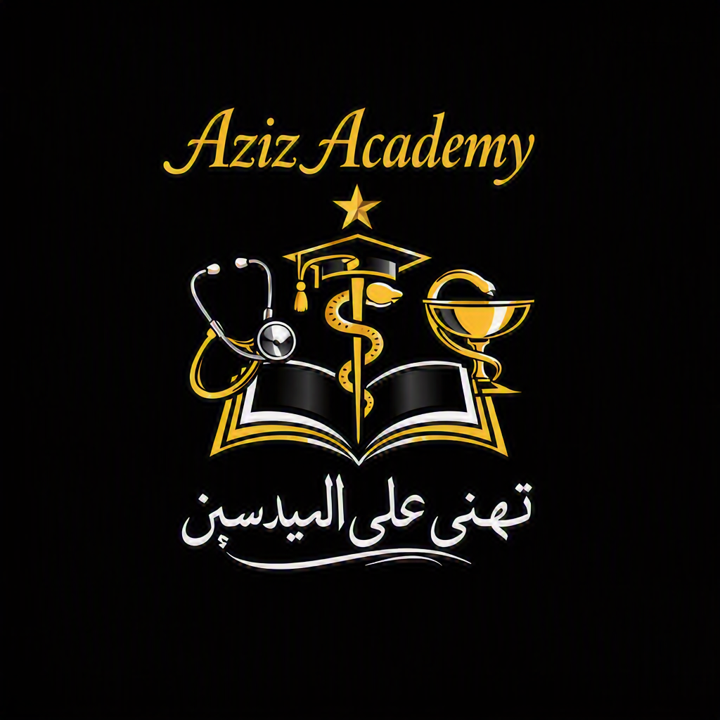

<!DOCTYPE html>
<html lang="ar">
<head>
  <meta charset="UTF-8">
  <title>Aziz Academy</title>
  
</head>
<body>
  <header>
    
    <nav>
      <a href="#">الرئيسية</a>
      <a href="#">من نحن؟</a>
      <a href="#">البرامج</a>
      <a href="#">الموارد</a>
      <a href="#">اتصل بنا</a>
    </nav>
  </header>

  

    <h1>Aziz Academy</h1>
    
منصة تعليمية حديثة تجمع بين الطب والعلم والمعرفة.

  

  

    <h2>من نحن؟</h2>
    
أكاديمية عزيز هي فضاء تعليمي حديث يهدف إلى تكوين الطلبة في المجالات الطبية والعلمية، مع موارد رقمية ودروس تفاعلية.

  

  <footer>
    © 2026 Aziz Academy – جميع الحقوق محفوظة
  </footer>
</body>
</html>
